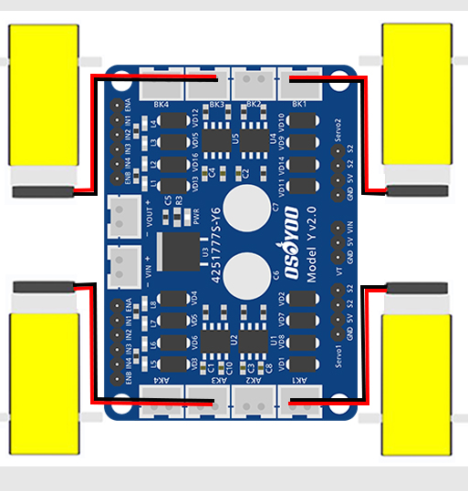
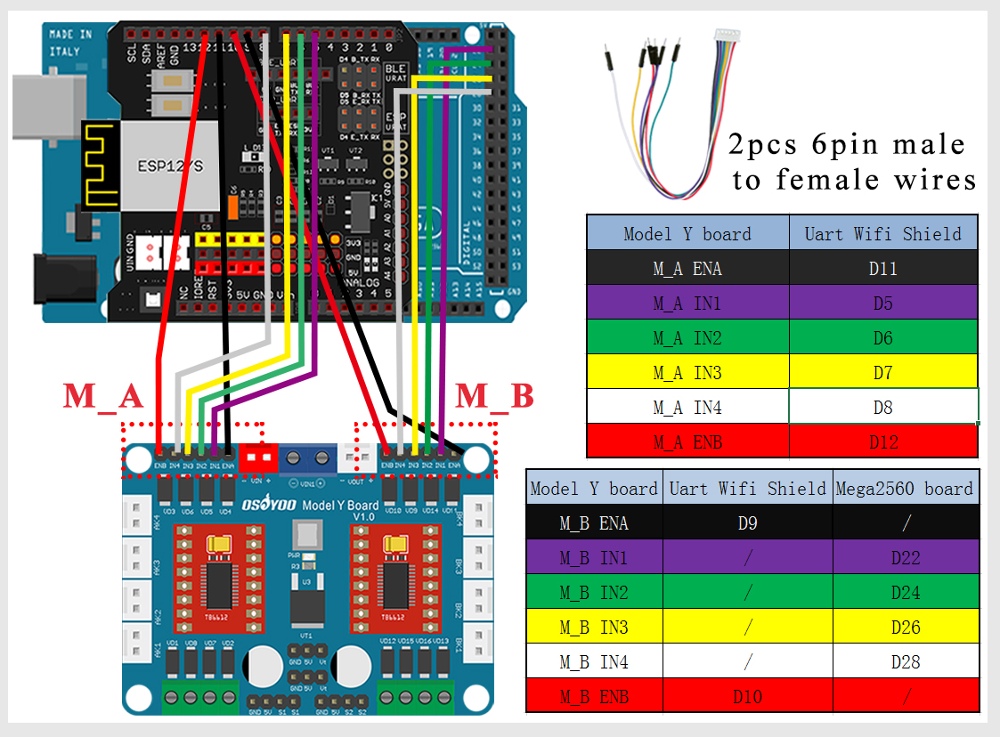
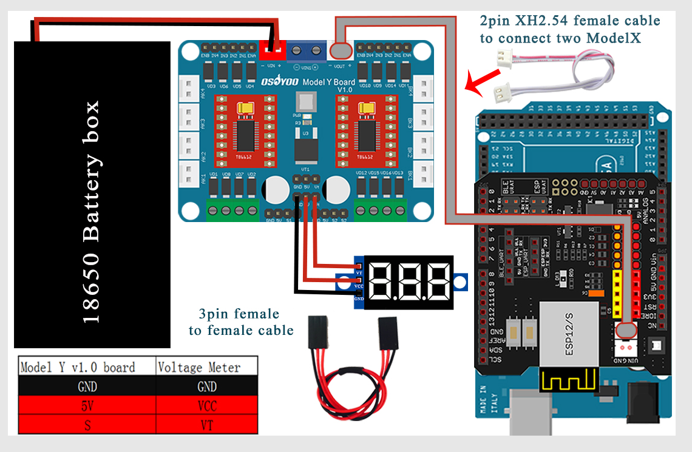
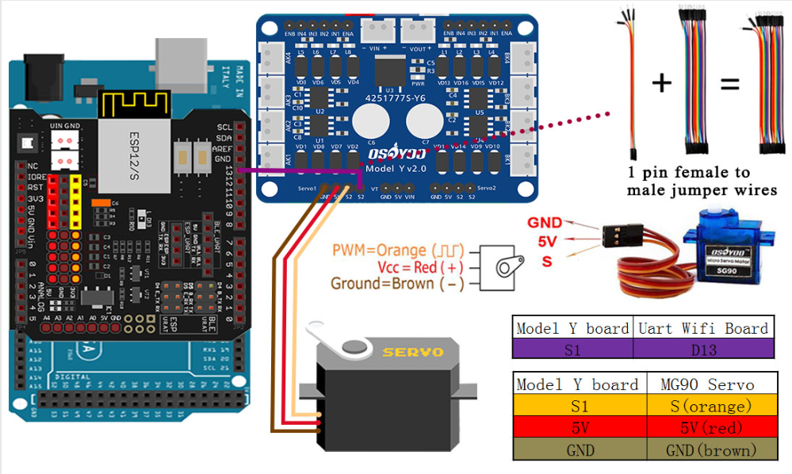
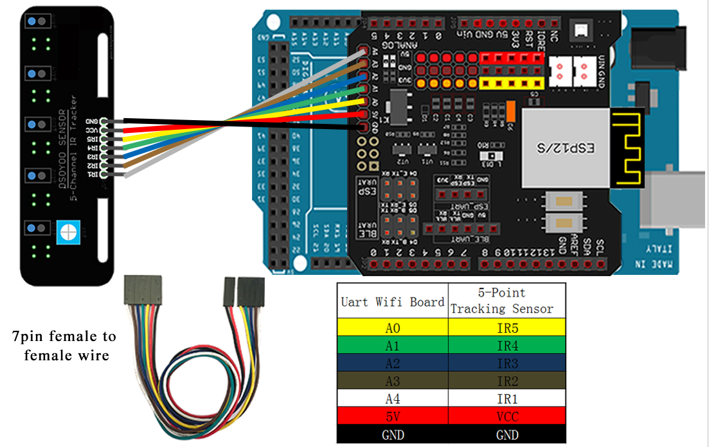
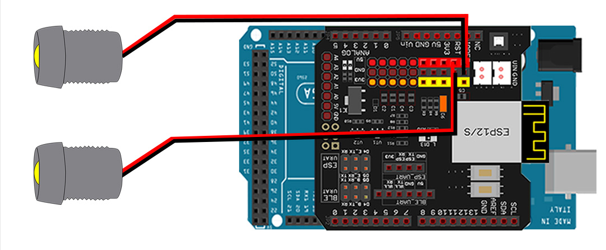

# Omni Wheel Robotic Car
Replace this text with a brief description (2-3 sentences) of your project. This description should draw the reader in and make them interested in what you've built. You can include what the biggest challenges, takeaways, and triumphs from completing the project were. As you complete your portfolio, remember your audience is less familiar than you are with all that your project entails!

| **Engineer** | **School** | **Area of Interest** | **Grade** |
|:--:|:--:|:--:|:--:|
| Logan C. | Dublin High School | Electrical Engineering | Incoming Junior

**Replace the BlueStamp logo below with an image of yourself and your completed project. Follow the guide [here](https://tomcam.github.io/least-github-pages/adding-images-github-pages-site.html) if you need help.**


  
# Final Milestone
For your final milestone, explain the outcome of your project. Key details to include are:
- What you've accomplished since your previous milestone
- What your biggest challenges and triumphs were at BSE
- A summary of key topics you learned about
- What you hope to learn in the future after everything you've learned at BSE

**Don't forget to replace the text below with the embedding for your milestone video. Go to Youtube, click Share -> Embed, and copy and paste the code to replace what's below.**

<iframe width="560" height="315" src="https://www.youtube.com/embed/F7M7imOVGug" title="YouTube video player" frameborder="0" allow="accelerometer; autoplay; clipboard-write; encrypted-media; gyroscope; picture-in-picture; web-share" allowfullscreen></iframe>

# Second Milestone
For your second milestone, explain what you've worked on since your previous milestone. You can highlight:
For my second milestone, I decided to implement a bluetooth device into my car in order for it to be remotely controlled. 
- Technical details of what you've accomplished and how they contribute to the final goal
- What has been surprising about the project so far
- Previous challenges you faced that you overcame
- What needs to be completed before your final milestone 

**Don't forget to replace the text below with the embedding for your milestone video. Go to Youtube, click Share -> Embed, and copy and paste the code to replace what's below.**

<iframe width="560" height="315" src="https://www.youtube.com/embed/y3VAmNlER5Y" title="YouTube video player" frameborder="0" allow="accelerometer; autoplay; clipboard-write; encrypted-media; gyroscope; picture-in-picture; web-share" allowfullscreen></iframe>

# First Milestone

The most important part of this whole project is to build the car and getting the omniwheel car to move in every direction. For my first milestone, I built up the whole car and implemented the code into the arduino to get it to start moving. One change that I did make was that I replaced the battery pack that had originally came with the kit. This change was made as a safety precaution as the batteries that would be used in the previous battery holder were lithium batteries. A few challenges that I had faced was putting the wires together. There was a lot of wiring required in order to get all the functions on the car to work. Another challenge that I had faced was getting all the parts tightened on my car. I had to constantly go back to certain parts on the car, especially the wheels. My plan going forward is to make slight modifications that can utilize the cars ability to move in any direction and also be able to control where it can go on command using bluetooth.

<iframe width="560" height="315" src="https://www.youtube.com/embed/gfWEIPeMH0o" title="YouTube video player" frameborder="0" allow="accelerometer; autoplay; clipboard-write; encrypted-media; gyroscope; picture-in-picture; web-share" allowfullscreen></iframe>


# Schematics 
Here's where you'll put images of your schematics. [Tinkercad](https://www.tinkercad.com/blog/official-guide-to-tinkercad-circuits) and [Fritzing](https://fritzing.org/learning/) are both great resoruces to create professional schematic diagrams, though BSE recommends Tinkercad becuase it can be done easily and for free in the browser. 








# Code
Here's where you'll put your code. The syntax below places it into a block of code. Follow the guide [here]([url](https://www.markdownguide.org/extended-syntax/)) to learn how to customize it to your project needs. 

```c++
#define SPEED 100    
#define TURN_SPEED 100    
#define speedPinR 9   //  Front Wheel PWM pin connect Model-Y M_B ENA 
#define RightMotorDirPin1  22    //Front Right Motor direction pin 1 to Model-Y M_B IN1  (K1)
#define RightMotorDirPin2  24   //Front Right Motor direction pin 2 to Model-Y M_B IN2   (K1)                                 
#define LeftMotorDirPin1  26    //Front Left Motor direction pin 1 to Model-Y M_B IN3 (K3)
#define LeftMotorDirPin2  28   //Front Left Motor direction pin 2 to Model-Y M_B IN4 (K3)
#define speedPinL 10   //  Front Wheel PWM pin connect Model-Y M_B ENB

#define speedPinRB 11   //  Rear Wheel PWM pin connect Left Model-Y M_A ENA 
#define RightMotorDirPin1B  5    //Rear Right Motor direction pin 1 to Model-Y M_A IN1 ( K1)
#define RightMotorDirPin2B 6    //Rear Right Motor direction pin 2 to Model-Y M_A IN2 ( K1) 
#define LeftMotorDirPin1B 7    //Rear Left Motor direction pin 1 to Model-Y M_A IN3  (K3)
#define LeftMotorDirPin2B 8  //Rear Left Motor direction pin 2 to Model-Y M_A IN4 (K3)
#define speedPinLB 12    //  Rear Wheel PWM pin connect Model-Y M_A ENB

/*motor control*/
void go_advance(int speed){
   RL_fwd(speed);
   RR_fwd(speed);
   FR_fwd(speed);
   FL_fwd(speed); 
}
void go_back(int speed){
   RL_bck(speed);
   RR_bck(speed);
   FR_bck(speed);
   FL_bck(speed); 
}
void right_shift(int speed_fl_fwd,int speed_rl_bck ,int speed_rr_fwd,int speed_fr_bck) {
  FL_fwd(speed_fl_fwd); 
  RL_bck(speed_rl_bck); 
  RR_fwd(speed_rr_fwd);
  FR_bck(speed_fr_bck);
}
void left_shift(int speed_fl_bck,int speed_rl_fwd ,int speed_rr_bck,int speed_fr_fwd){
   FL_bck(speed_fl_bck);
   RL_fwd(speed_rl_fwd);
   RR_bck(speed_rr_bck);
   FR_fwd(speed_fr_fwd);
}

void left_turn(int speed){
   RL_bck(0);
   RR_fwd(speed);
   FR_fwd(speed);
   FL_bck(0); 
}
void right_turn(int speed){
 //  RL_fwd(speed);
//   RR_bck(0);
 //  FR_bck(0);
 //  FL_fwd(speed); 

   RL_fwd(speed);
   RR_fwd(0);
   FR_fwd(0);
   FL_fwd(speed); 
}
void left_back(int speed){
   RL_fwd(0);
   RR_bck(speed);
   FR_bck(speed);
   FL_fwd(0); 
}
void right_back(int speed){
   RL_bck(speed);
   RR_fwd(0);
   FR_fwd(0);
   FL_bck(speed); 
}
void clockwise(int speed){
   RL_fwd(speed);
   RR_bck(speed);
   FR_bck(speed);
   FL_fwd(speed); 
}
void countclockwise(int speed){
   RL_bck(speed);
   RR_fwd(speed);
   FR_fwd(speed);
   FL_bck(speed); 
}


void FR_fwd(int speed)  //front-right wheel forward turn
{
  digitalWrite(RightMotorDirPin1,HIGH);
  digitalWrite(RightMotorDirPin2,LOW); 
  analogWrite(speedPinR,speed);
}
void FR_bck(int speed) // front-right wheel backward turn
{
  digitalWrite(RightMotorDirPin1,LOW);
  digitalWrite(RightMotorDirPin2,HIGH); 
  analogWrite(speedPinR,speed);
}
void FL_fwd(int speed) // front-left wheel forward turn
{
  digitalWrite(LeftMotorDirPin1,HIGH);
  digitalWrite(LeftMotorDirPin2,LOW);
  analogWrite(speedPinL,speed);
}
void FL_bck(int speed) // front-left wheel backward turn
{
  digitalWrite(LeftMotorDirPin1,LOW);
  digitalWrite(LeftMotorDirPin2,HIGH);
  analogWrite(speedPinL,speed);
}

void RR_fwd(int speed)  //rear-right wheel forward turn
{
  digitalWrite(RightMotorDirPin1B, HIGH);
  digitalWrite(RightMotorDirPin2B,LOW); 
  analogWrite(speedPinRB,speed);
}
void RR_bck(int speed)  //rear-right wheel backward turn
{
  digitalWrite(RightMotorDirPin1B, LOW);
  digitalWrite(RightMotorDirPin2B,HIGH); 
  analogWrite(speedPinRB,speed);
}
void RL_fwd(int speed)  //rear-left wheel forward turn
{
  digitalWrite(LeftMotorDirPin1B,HIGH);
  digitalWrite(LeftMotorDirPin2B,LOW);
  analogWrite(speedPinLB,speed);
}
void RL_bck(int speed)    //rear-left wheel backward turn
{
  digitalWrite(LeftMotorDirPin1B,LOW);
  digitalWrite(LeftMotorDirPin2B,HIGH);
  analogWrite(speedPinLB,speed);
}
 
void stop_Stop()    //Stop
{
  analogWrite(speedPinLB,0);
  analogWrite(speedPinRB,0);
  analogWrite(speedPinL,0);
  analogWrite(speedPinR,0);
}


//Pins initialize
void init_GPIO()
{
  pinMode(RightMotorDirPin1, OUTPUT); 
  pinMode(RightMotorDirPin2, OUTPUT); 
  pinMode(speedPinL, OUTPUT);  
 
  pinMode(LeftMotorDirPin1, OUTPUT);
  pinMode(LeftMotorDirPin2, OUTPUT); 
  pinMode(speedPinR, OUTPUT);
  pinMode(RightMotorDirPin1B, OUTPUT); 
  pinMode(RightMotorDirPin2B, OUTPUT); 
  pinMode(speedPinLB, OUTPUT);  
 
  pinMode(LeftMotorDirPin1B, OUTPUT);
  pinMode(LeftMotorDirPin2B, OUTPUT); 
  pinMode(speedPinRB, OUTPUT);
   
  stop_Stop();
}

void setup()
{
  init_GPIO();
 
go_advance(SPEED);
     delay(1000);
     stop_Stop();
     delay(1000);
  
go_back(SPEED);
      delay(1000);
      stop_Stop();
      delay(1000);
	  
left_turn(TURN_SPEED);
      delay(1000);
      stop_Stop();
      delay(1000);
	  
right_turn(TURN_SPEED);
     delay(1000);
     stop_Stop();
     delay(1000);
  
right_shift(200,200,200,200); //right shift
     delay(1000);
     stop_Stop();
     delay(1000);

left_shift(200,200,200,200); //left shift
     delay(1000);
     stop_Stop();
     delay(1000);
	 
left_shift(200,0,200,0); //left diagonal back
     delay(1000);
     stop_Stop();
	 delay(1000);
 
right_shift(200,0,200,0); //right diagonal ahead
     delay(1000);
     stop_Stop();
	 delay(1000);

left_shift(0,200,0,200); //left diagonal ahead
     delay(1000);
     stop_Stop();
     delay(1000);

right_shift(0,200,0,200); //right diagonal back
     delay(1000);
     stop_Stop();
	 delay(1000);
}
```

# Bill of Materials
Here's where you'll list the parts in your project. To add more rows, just copy and paste the example rows below.
Don't forget to place the link of where to buy each component inside the quotation marks in the corresponding row after href =. Follow the guide [here]([url](https://www.markdownguide.org/extended-syntax/)) to learn how to customize this to your project needs. 

| **Part** | **Note** | **Price** | **Link** |
|:--:|:--:|:--:|:--:|
| Car Chassis | Base of the omniwheel car | $7.99 | <a href="https://osoyoo.store/collections/parts-for-blue-mecanum-wheel-robotic-car-kit-for-arduino-mega2560-model-2021006601/products/model-2021006600-blue-mecanum-wheel-robotic-car-acrylic-chassis?variant=40715880333423"> Link </a> |
|:--:|:--:|:--:|:--:|
| Gear Motor | Turns the wheels on the robot car | $5.99 | <a href="https://osoyoo.store/collections/parts-for-blue-mecanum-wheel-robotic-car-kit-for-arduino-mega2560-model-2021006601/products/tt-motor-with-wire-and-connection-for-arduino-v2-0-robot-carmodel-2016013200m-1?variant=31648986857583"> Link </a> |
|:--:|:--:|:--:|:--:|
| Mecanum Wheels | Wheels used for the car | $19.99 | <a href="https://osoyoo.store/collections/parts-for-blue-mecanum-wheel-robotic-car-kit-for-arduino-mega2560-model-2021006601/products/model-2021006600-blue-mecanum-wheels-60mm?variant=40715901698159"> Link </a> |
|:--:|:--:|:--:|:--:|
| Mega2560 Arduino Board | Arduino board used to upload arduino program into | $20.69 | <a href="https://www.amazon.com/SunFounder-ATmega2560-16AU-Board-Compatible-Arduino/dp/B00D9NA4CY"> Link </a> |
|:--:|:--:|:--:|:--:|
| Osyoo Wi-Fi Shield | Allows the arduino to connect to the internet using WiFi | $12.99 | <a href="https://osoyoo.store/products/esp8266-wifi-shiled-osoyoo-wifi-internet-of-things-learning-kit-for-arduino-uno?variant=31955252215919"> Link </a> |
|:--:|:--:|:--:|:--:|
| Osyoo Model Y 2.0 Motor Driver Module | Connects the motors to all other systems in the car | $19.98 | <a href="https://osoyoo.store/products/products-model-y-motor-driver-board-for-arduino-robotic-car-kit-model-2021006600?variant=41034891231343"> Link </a> |
|:--:|:--:|:--:|:--:|
| Obstacle Avoidance Sensor | Sensor used to locate where objects are | $3.50 | <a href="https://osoyoo.store/collections/parts-for-blue-mecanum-wheel-robotic-car-kit-for-arduino-mega2560-model-2021006601/products/ir-obstacle-avoidance-module-for-arduino-v2-0-robot-carmodel-2016000400?variant=31648429015151"> Link </a> |
|:--:|:--:|:--:|:--:|
| Tracking Sensor Module | Can detect the color of an object | $9.99 | <a href="https://osoyoo.store/collections/parts-for-blue-mecanum-wheel-robotic-car-kit-for-arduino-mega2560-model-2021006601/products/5-channel-tracking-sensor-for-osoyoo-model-3-robot-learning-kit-v2-model-2020001700?variant=31930528497775"> Link </a> |
|:--:|:--:|:--:|:--:|
| Ultrasonic Sensor Holder and Ultrasonic Sensor| Senses ultrasonic energy waves and is connected to the motors | $9.99 | <a href="https://osoyoo.store/collections/parts-for-blue-mecanum-wheel-robotic-car-kit-for-arduino-mega2560-model-2021006601/products/ultrasonic-sensor-and-ultrasonic-sensor-holder?variant=32077243809903"> Link </a> |
|:--:|:--:|:--:|:--:|
| SG 90 Servo Motor | Rotates the ultrasonic sensor to detect objects | $7.99 | <a href="https://osoyoo.store/products/micro-servo-sg90-blue-for-arduino-v2-0-robot-carmodel-lacc200610?variant=31648847560815"> Link </a> |
|:--:|:--:|:--:|:--:|
| Voltage Meter | Gives the amount of volts going through the car | $6.99 | <a href="https://osoyoo.store/products/voltage-meter-for-arduino-v2-0-robot-carmodel-2017005300?variant=31648871121007"> Link </a> |
|:--:|:--:|:--:|:--:|
| LED Light | Light placed in the front of the car for better vision | $8.99 | <a href="https://osoyoo.store/collections/parts-for-blue-mecanum-wheel-robotic-car-kit-for-arduino-mega2560-model-2021006601/products/led-lights-for-blue-mecanum-wheel-robotic-car-kit-for-arduino-mega2560-model-2021006600?variant=40715976474735"> Link </a> |
|:--:|:--:|:--:|:--:|
| Battery Pack | Holds the batteries that power the entire car | $1.80 | <a href="https://www.amazon.com/Vanki-Battery-Holder-Case-Leads/dp/B073XC52BG/ref=sr_1_3?keywords=5%2Baa%2Bbattery%2Bholder&qid=1687379525&sr=8-3&th=1"> Link </a> |
|:--:|:--:|:--:|:--:|
| AA Batteries | Powers the entire car | $9.73 | <a href="https://www.amazon.com/AmazonBasics-Performance-Alkaline-Batteries-20-Pack/dp/B00NTCH52W/ref=sr_1_5?crid=2P2IO9C1C9G8U&keywords=AA+battery&qid=1687379629&sprefix=aa+battery%2Caps%2C155&sr=8-5"> Link </a> |
|:--:|:--:|:--:|:--:|


# Other Resources/Examples
One of the best parts about Github is that you can view how other people set up their own work. Here are some past BSE portfolios that are awesome examples. You can view how they set up their portfolio, and you can view their index.md files to understand how they implemented different portfolio components.
- [Example 1](https://trashytuber.github.io/YimingJiaBlueStamp/)
- [Example 2](https://sviatil0.github.io/Sviatoslav_BSE/)
- [Example 3](https://arneshkumar.github.io/arneshbluestamp/)

To watch the BSE tutorial on how to create a portfolio, click here.
