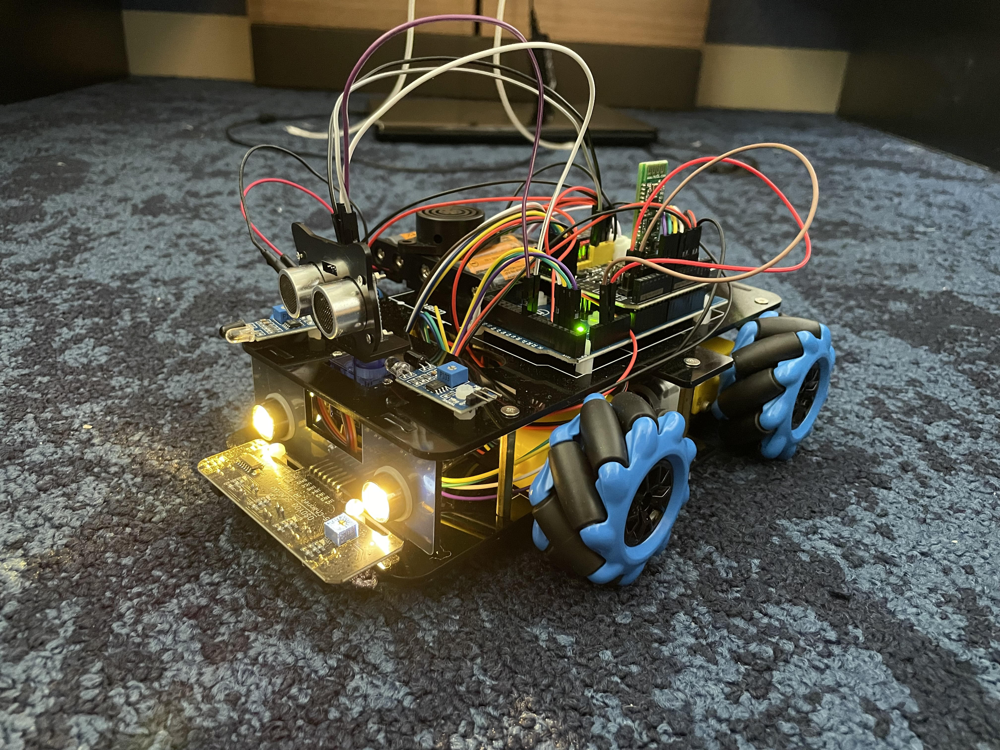

# Omni Wheel Robotic Car
The Omni wheel car is a multidirectional robot car, with a built-in Arduino system. This can be used to mak many modifications to the car using the many different sensors that come with the kit but can also be bought online.

| **Engineer** | **School** | **Area of Interest** | **Grade** |
|:--:|:--:|:--:|:--:|
| Logan C. | Dublin High School | Electrical Engineering | Incoming Junior

**Replace the BlueStamp logo below with an image of yourself and your completed project. Follow the guide [here](https://tomcam.github.io/least-github-pages/adding-images-github-pages-site.html) if you need help.**


  
# Final Milestone
For my final milestone, I will attach a buzzer and LED light onto my already finished car that would make a buzzing sound and also light up once it gets too close to an object. The bigest challenge for this was having to reconfigure the code as well as working with the parts I was given. I did not get all the parts that I needed in order to actually finish building this modification, so I had to work with what I had. This helped me problem solve while using the arduino to actually finish coding the attachment I had wanted to make. In the future I would hope to continue to work on projects similar to this one and carry the knowledge that I have gained while being able to use many different resources I had. This includes GitHub, Arduino, as well as basic fundamentals of putting robots together.

<iframe width="560" height="315" src="https://www.youtube.com/embed/4YpHRfEwzKc" title="YouTube video player" frameborder="0" allow="accelerometer; autoplay; clipboard-write; encrypted-media; gyroscope; picture-in-picture; web-share" allowfullscreen></iframe>

# Second Milestone
After finishing building my car, I wanted to have the ability to actually control the movements. I did this by implementing the Bluetooth device provided in the kit. After plugging in the bluetooth connecter, all I had to do was hook it up to the board and then plug the arduino in and upload the code. Then I was able to actually use my phone by connecting the bluetooth on the robot to the bluetooth on my phone. I was then able to move the car in the northeast, northwest, southeast, and southwest direction and control whether the motor is on or off. It has been surprising how much I have been able to accomplish and the many different features I could add to the robot. Using an arduino gives me a lot of freedom to implement many features. For my final milestone, I am planning on modifying the bot based on its new ability to move in any direction that I choose. 

<iframe width="560" height="315" src="https://www.youtube.com/embed/lcHz_vlNtDk" title="YouTube video player" frameborder="0" allow="accelerometer; autoplay; clipboard-write; encrypted-media; gyroscope; picture-in-picture; web-share" allowfullscreen></iframe>

# First Milestone

The most important part of this whole project is to build the car and getting the omniwheel car to move in every direction. For my first milestone, I built up the whole car and implemented the code into the arduino to get it to start moving. One change that I did make was that I replaced the battery pack that had originally came with the kit. This change was made as a safety precaution as the batteries that would be used in the previous battery holder were lithium batteries. A few challenges that I had faced was putting the wires together. There was a lot of wiring required in order to get all the functions on the car to work. Another challenge that I had faced was getting all the parts tightened on my car. I had to constantly go back to certain parts on the car, especially the wheels. My plan going forward is to make slight modifications that can utilize the cars ability to move in any direction and also be able to control where it can go on command using bluetooth.

<iframe width="560" height="315" src="https://www.youtube.com/embed/gfWEIPeMH0o" title="YouTube video player" frameborder="0" allow="accelerometer; autoplay; clipboard-write; encrypted-media; gyroscope; picture-in-picture; web-share" allowfullscreen></iframe>


# Schematics 


# Code

```c++
#define SPEED 100    
#define TURN_SPEED 100    
#define speedPinR 9   //  Front Wheel PWM pin connect Model-Y M_B ENA 
#define RightMotorDirPin1  22    //Front Right Motor direction pin 1 to Model-Y M_B IN1  (K1)
#define RightMotorDirPin2  24   //Front Right Motor direction pin 2 to Model-Y M_B IN2   (K1)                                 
#define LeftMotorDirPin1  26    //Front Left Motor direction pin 1 to Model-Y M_B IN3 (K3)
#define LeftMotorDirPin2  28   //Front Left Motor direction pin 2 to Model-Y M_B IN4 (K3)
#define speedPinL 10   //  Front Wheel PWM pin connect Model-Y M_B ENB

#define speedPinRB 11   //  Rear Wheel PWM pin connect Left Model-Y M_A ENA 
#define RightMotorDirPin1B  5    //Rear Right Motor direction pin 1 to Model-Y M_A IN1 ( K1)
#define RightMotorDirPin2B 6    //Rear Right Motor direction pin 2 to Model-Y M_A IN2 ( K1) 
#define LeftMotorDirPin1B 7    //Rear Left Motor direction pin 1 to Model-Y M_A IN3  (K3)
#define LeftMotorDirPin2B 8  //Rear Left Motor direction pin 2 to Model-Y M_A IN4 (K3)
#define speedPinLB 12    //  Rear Wheel PWM pin connect Model-Y M_A ENB

/*motor control*/
void go_advance(int speed){
   RL_fwd(speed);
   RR_fwd(speed);
   FR_fwd(speed);
   FL_fwd(speed); 
}
void go_back(int speed){
   RL_bck(speed);
   RR_bck(speed);
   FR_bck(speed);
   FL_bck(speed); 
}
void right_shift(int speed_fl_fwd,int speed_rl_bck ,int speed_rr_fwd,int speed_fr_bck) {
  FL_fwd(speed_fl_fwd); 
  RL_bck(speed_rl_bck); 
  RR_fwd(speed_rr_fwd);
  FR_bck(speed_fr_bck);
}
void left_shift(int speed_fl_bck,int speed_rl_fwd ,int speed_rr_bck,int speed_fr_fwd){
   FL_bck(speed_fl_bck);
   RL_fwd(speed_rl_fwd);
   RR_bck(speed_rr_bck);
   FR_fwd(speed_fr_fwd);
}

void left_turn(int speed){
   RL_bck(0);
   RR_fwd(speed);
   FR_fwd(speed);
   FL_bck(0); 
}
void right_turn(int speed){
 //  RL_fwd(speed);
//   RR_bck(0);
 //  FR_bck(0);
 //  FL_fwd(speed); 

   RL_fwd(speed);
   RR_fwd(0);
   FR_fwd(0);
   FL_fwd(speed); 
}
void left_back(int speed){
   RL_fwd(0);
   RR_bck(speed);
   FR_bck(speed);
   FL_fwd(0); 
}
void right_back(int speed){
   RL_bck(speed);
   RR_fwd(0);
   FR_fwd(0);
   FL_bck(speed); 
}
void clockwise(int speed){
   RL_fwd(speed);
   RR_bck(speed);
   FR_bck(speed);
   FL_fwd(speed); 
}
void countclockwise(int speed){
   RL_bck(speed);
   RR_fwd(speed);
   FR_fwd(speed);
   FL_bck(speed); 
}


void FR_fwd(int speed)  //front-right wheel forward turn
{
  digitalWrite(RightMotorDirPin1,HIGH);
  digitalWrite(RightMotorDirPin2,LOW); 
  analogWrite(speedPinR,speed);
}
void FR_bck(int speed) // front-right wheel backward turn
{
  digitalWrite(RightMotorDirPin1,LOW);
  digitalWrite(RightMotorDirPin2,HIGH); 
  analogWrite(speedPinR,speed);
}
void FL_fwd(int speed) // front-left wheel forward turn
{
  digitalWrite(LeftMotorDirPin1,HIGH);
  digitalWrite(LeftMotorDirPin2,LOW);
  analogWrite(speedPinL,speed);
}
void FL_bck(int speed) // front-left wheel backward turn
{
  digitalWrite(LeftMotorDirPin1,LOW);
  digitalWrite(LeftMotorDirPin2,HIGH);
  analogWrite(speedPinL,speed);
}

void RR_fwd(int speed)  //rear-right wheel forward turn
{
  digitalWrite(RightMotorDirPin1B, HIGH);
  digitalWrite(RightMotorDirPin2B,LOW); 
  analogWrite(speedPinRB,speed);
}
void RR_bck(int speed)  //rear-right wheel backward turn
{
  digitalWrite(RightMotorDirPin1B, LOW);
  digitalWrite(RightMotorDirPin2B,HIGH); 
  analogWrite(speedPinRB,speed);
}
void RL_fwd(int speed)  //rear-left wheel forward turn
{
  digitalWrite(LeftMotorDirPin1B,HIGH);
  digitalWrite(LeftMotorDirPin2B,LOW);
  analogWrite(speedPinLB,speed);
}
void RL_bck(int speed)    //rear-left wheel backward turn
{
  digitalWrite(LeftMotorDirPin1B,LOW);
  digitalWrite(LeftMotorDirPin2B,HIGH);
  analogWrite(speedPinLB,speed);
}
 
void stop_Stop()    //Stop
{
  analogWrite(speedPinLB,0);
  analogWrite(speedPinRB,0);
  analogWrite(speedPinL,0);
  analogWrite(speedPinR,0);
}


//Pins initialize
void init_GPIO()
{
  pinMode(RightMotorDirPin1, OUTPUT); 
  pinMode(RightMotorDirPin2, OUTPUT); 
  pinMode(speedPinL, OUTPUT);  
 
  pinMode(LeftMotorDirPin1, OUTPUT);
  pinMode(LeftMotorDirPin2, OUTPUT); 
  pinMode(speedPinR, OUTPUT);
  pinMode(RightMotorDirPin1B, OUTPUT); 
  pinMode(RightMotorDirPin2B, OUTPUT); 
  pinMode(speedPinLB, OUTPUT);  
 
  pinMode(LeftMotorDirPin1B, OUTPUT);
  pinMode(LeftMotorDirPin2B, OUTPUT); 
  pinMode(speedPinRB, OUTPUT);
   
  stop_Stop();
}

void setup()
{
  init_GPIO();
 
go_advance(SPEED);
     delay(1000);
     stop_Stop();
     delay(1000);
  
go_back(SPEED);
      delay(1000);
      stop_Stop();
      delay(1000);
	  
left_turn(TURN_SPEED);
      delay(1000);
      stop_Stop();
      delay(1000);
	  
right_turn(TURN_SPEED);
     delay(1000);
     stop_Stop();
     delay(1000);
  
right_shift(200,200,200,200); //right shift
     delay(1000);
     stop_Stop();
     delay(1000);

left_shift(200,200,200,200); //left shift
     delay(1000);
     stop_Stop();
     delay(1000);
	 
left_shift(200,0,200,0); //left diagonal back
     delay(1000);
     stop_Stop();
	 delay(1000);
 
right_shift(200,0,200,0); //right diagonal ahead
     delay(1000);
     stop_Stop();
	 delay(1000);

left_shift(0,200,0,200); //left diagonal ahead
     delay(1000);
     stop_Stop();
     delay(1000);

right_shift(0,200,0,200); //right diagonal back
     delay(1000);
     stop_Stop();
	 delay(1000);
}
```

# Bill of Materials

| **Part** | **Note** | **Price** | **Link** |
|:--:|:--:|:--:|:--:|
| Car Chassis | Base of the omniwheel car | $7.99 | <a href="https://osoyoo.store/collections/parts-for-blue-mecanum-wheel-robotic-car-kit-for-arduino-mega2560-model-2021006601/products/model-2021006600-blue-mecanum-wheel-robotic-car-acrylic-chassis?variant=40715880333423"> Link </a> |
|:--:|:--:|:--:|:--:|
| Gear Motor | Turns the wheels on the robot car | $5.99 | <a href="https://osoyoo.store/collections/parts-for-blue-mecanum-wheel-robotic-car-kit-for-arduino-mega2560-model-2021006601/products/tt-motor-with-wire-and-connection-for-arduino-v2-0-robot-carmodel-2016013200m-1?variant=31648986857583"> Link </a> |
|:--:|:--:|:--:|:--:|
| Mecanum Wheels | Wheels used for the car | $19.99 | <a href="https://osoyoo.store/collections/parts-for-blue-mecanum-wheel-robotic-car-kit-for-arduino-mega2560-model-2021006601/products/model-2021006600-blue-mecanum-wheels-60mm?variant=40715901698159"> Link </a> |
|:--:|:--:|:--:|:--:|
| Mega2560 Arduino Board | Arduino board used to upload arduino program into | $20.69 | <a href="https://www.amazon.com/SunFounder-ATmega2560-16AU-Board-Compatible-Arduino/dp/B00D9NA4CY"> Link </a> |
|:--:|:--:|:--:|:--:|
| Osyoo Wi-Fi Shield | Allows the arduino to connect to the internet using WiFi | $12.99 | <a href="https://osoyoo.store/products/esp8266-wifi-shiled-osoyoo-wifi-internet-of-things-learning-kit-for-arduino-uno?variant=31955252215919"> Link </a> |
|:--:|:--:|:--:|:--:|
| Osyoo Model Y 2.0 Motor Driver Module | Connects the motors to all other systems in the car | $19.98 | <a href="https://osoyoo.store/products/products-model-y-motor-driver-board-for-arduino-robotic-car-kit-model-2021006600?variant=41034891231343"> Link </a> |
|:--:|:--:|:--:|:--:|
| Obstacle Avoidance Sensor | Sensor used to locate where objects are | $3.50 | <a href="https://osoyoo.store/collections/parts-for-blue-mecanum-wheel-robotic-car-kit-for-arduino-mega2560-model-2021006601/products/ir-obstacle-avoidance-module-for-arduino-v2-0-robot-carmodel-2016000400?variant=31648429015151"> Link </a> |
|:--:|:--:|:--:|:--:|
| Tracking Sensor Module | Can detect the color of an object | $9.99 | <a href="https://osoyoo.store/collections/parts-for-blue-mecanum-wheel-robotic-car-kit-for-arduino-mega2560-model-2021006601/products/5-channel-tracking-sensor-for-osoyoo-model-3-robot-learning-kit-v2-model-2020001700?variant=31930528497775"> Link </a> |
|:--:|:--:|:--:|:--:|
| Ultrasonic Sensor Holder and Ultrasonic Sensor| Senses ultrasonic energy waves and is connected to the motors | $9.99 | <a href="https://osoyoo.store/collections/parts-for-blue-mecanum-wheel-robotic-car-kit-for-arduino-mega2560-model-2021006601/products/ultrasonic-sensor-and-ultrasonic-sensor-holder?variant=32077243809903"> Link </a> |
|:--:|:--:|:--:|:--:|
| SG 90 Servo Motor | Rotates the ultrasonic sensor to detect objects | $7.99 | <a href="https://osoyoo.store/products/micro-servo-sg90-blue-for-arduino-v2-0-robot-carmodel-lacc200610?variant=31648847560815"> Link </a> |
|:--:|:--:|:--:|:--:|
| Voltage Meter | Gives the amount of volts going through the car | $6.99 | <a href="https://osoyoo.store/products/voltage-meter-for-arduino-v2-0-robot-carmodel-2017005300?variant=31648871121007"> Link </a> |
|:--:|:--:|:--:|:--:|
| LED Light | Light placed in the front of the car for better vision | $8.99 | <a href="https://osoyoo.store/collections/parts-for-blue-mecanum-wheel-robotic-car-kit-for-arduino-mega2560-model-2021006601/products/led-lights-for-blue-mecanum-wheel-robotic-car-kit-for-arduino-mega2560-model-2021006600?variant=40715976474735"> Link </a> |
|:--:|:--:|:--:|:--:|
| Battery Pack | Holds the batteries that power the entire car | $1.80 | <a href="https://www.amazon.com/Vanki-Battery-Holder-Case-Leads/dp/B073XC52BG/ref=sr_1_3?keywords=5%2Baa%2Bbattery%2Bholder&qid=1687379525&sr=8-3&th=1"> Link </a> |
|:--:|:--:|:--:|:--:|
| AA Batteries | Powers the entire car | $9.73 | <a href="https://www.amazon.com/AmazonBasics-Performance-Alkaline-Batteries-20-Pack/dp/B00NTCH52W/ref=sr_1_5?crid=2P2IO9C1C9G8U&keywords=AA+battery&qid=1687379629&sprefix=aa+battery%2Caps%2C155&sr=8-5"> Link </a> |
|:--:|:--:|:--:|:--:|

